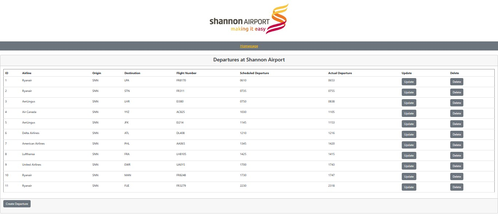

# Assessment: Data Representation Project

by Sarah McNelis

 

## Introduction

This repository contains my project work for Data Representation as part of my Higher Diploma in Computing in Data Analytics. 

 
 
## Setup

### Install the following

1. Download and install [anaconda](https://docs.anaconda.com/anaconda/install/index.html).
2. Download and install [cmder](https://cmder.app/).
3. Download and install [notepad++](https://notepad-plus-plus.org/downloads/)
4. Download and install [wampserver](https://www.wampserver.com/en/)

### Requirements text file

`requirements.txt` contains a list of all the packages requried to successfully run my flask server and it's RESTful API. 

### Running a python file

1. Open the command line at the appropriate respository. 
2. Type `python ` followed by the filename you wish to execute. 
3. The file will run. 

### Running a html file

1. Open the desired file in Notepad++
2. Click View on the toolbar
3. And click View Current File in and choose your preferred browser. 

### Accessing MySQL database and tables

1. Open wampserver
2. Click on MySQL and then on MySQL console
3. Enter user and password
4. Once the console is open type `SHOW DATABASES;`
5. For this I have named my database "project". So I would type `USE project;`
6. Now in the database type `SHOW TABLES;`. This shows all tables available within that database. See image below of the current tables in my project database.  
 

 
7. To see the arrivals table type `SELECT * FROM arrivals;`. This produces the following table. 
 

 
8. To see the departures table type `SELECT * FROM departures;`. This produces the following table. 
 

 
9. These tables can be accessed and updated using SQL commands from my python scripts. See `airportDAO.py` and execute in the command line. 

### Hosting the server

I have chosen to host my server on ... 
You can find the host server link [here]() 

 

## What to expect
This repository contains:

- `homepage.html` - this document creates a fictional homepage for Shannon Airport where the user can select to view arrivals or departures. 

 

 

- `arrivals.html` - where I created a webpage based on fictional Shannon Airport arrival information. In this document you will find CRUD operations in the script section which allow the webpage to consume the API. 

 

 

- `departures.html` - where I created a webpage based on fictional Shannon Airport departure information. You will also find CRUD operations in the script section which allow the webpage to consume the API. 

 

 

- `rest_server.py` - which creates an application server that will implement a RESTful API using Flask. 

- `airportDAO.py` - this program creates two classes - one for arrivals and one for departures. These contain functions to implement SQL commands from a python script. These classes are imported into the `rest_server.py` and used to perform CRUD operations. 

 

## Credits

- For this project I heavely relied on my lecturer's notes. You can access his github repository [here](https://github.com/andrewbeattycourseware/datarepresentation).

 

## References

- https://docs.python-guide.org/dev/virtualenvs/
- https://flask.palletsprojects.com/en/latest/
- https://realpython.com/python-requests/
- https://requests.readthedocs.io/en/latest/
- https://docs.python.org/3/library/urllib.html
- https://realpython.com/flask-connexion-rest-api/
- https://getbootstrap.com/docs/3.4/css/ 
- https://dev.mysql.com/doc/connector-python/en/connector-python-examples.html
- 

 

## End